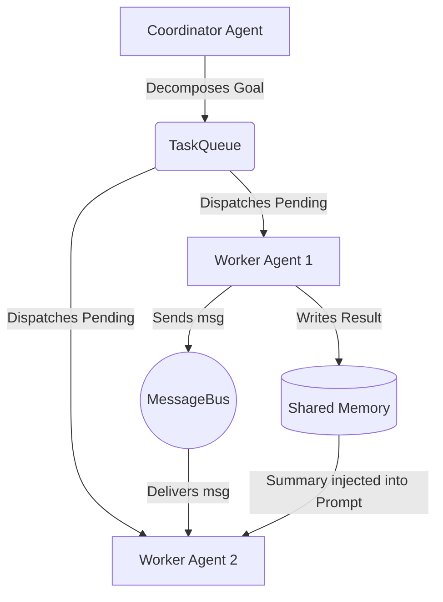

# Claude Code Architecture & KAIROS Daemon Extraction
**Date:** March 31, 2026
**Target:** Anthropic "Claude Code" Source Map Leak / `open-multi-agent`

## 🎯 Executive Summary
Based on the March 31, 2026 source map leak of Anthropic's `claude-code` and the clean-room reimplementation in the `open-multi-agent` repository, this document outlines the core architectural patterns used to orchestrate high-agency AI developer tools. 

These patterns have been specifically extracted and mapped for translation to a local hardware stack, specifically an AMD Radeon RX 9070 XT (16GB VRAM) and Ryzen 7 5700X3D.

---

## 1. The Coordinator Pattern & TaskQueue

Anthropic completely sidesteps the issue of LLMs getting confused by massive tasks by using a **"Coordinator -> Worker"** topology. Instead of answering the prompt directly, a temporary Coordinator model is instructed to output a dependency graph.

### The Decomposer Prompt Template
This is the system prompt used to force the LLM to output a structured dependency graph rather than directly executing the user's request.

```text
You are a task coordinator responsible for decomposing high-level goals
into concrete, actionable tasks and assigning them to the right team members.

## Team Roster
- **researcher** (claude-opus-4-6): You are a researcher.
- **writer** (claude-opus-4-6): You are a technical writer.

## Output Format
When asked to decompose a goal, respond ONLY with a JSON array of task objects.
Each task must have:
  - "title":       Short descriptive title (string)
  - "description": Full task description with context and expected output (string)
  - "assignee":    One of the agent names listed in the roster (string)
  - "dependsOn":   Array of titles of tasks this task depends on (string[], may be empty)

Wrap the JSON in a ```json code fence.
Do not include any text outside the code fence.
```

### TaskQueue Mechanism
The output is parsed and fed into a `TaskQueue` that uses topological sorting. Tasks start as `blocked`. Once a dependency fires a `task:complete` event, the queue automatically promotes downstream tasks to `pending` and dispatches them to the available agents.

---

## 2. The `MessageBus` (Shared Memory)

To avoid passing massive 100k+ token conversation histories back and forth between agents, the architecture uses an isolated, point-to-point `MessageBus`. 

Worker agents only receive:
1. The specific task description.
2. A *summary* of completed dependencies from Shared Memory.
3. Any *direct messages* sent to them via the MessageBus.

### Architecture Flow Diagram



---

## 3. Schema Validation & Auto-Correction ("2-Bit Drunk" Mitigation)

When running local quantized models (like a 2-bit 35B model), JSON hallucinations are inevitable. The leaked architecture mitigates this gracefully using a `ToolExecutor` that wraps Zod validation.

Instead of throwing a fatal exception when the LLM outputs malformed JSON, the execution layer catches the schema parsing error and **feeds it back to the LLM as a tool result** so the model can auto-correct.

### Python Translation Blueprint (Pydantic wrapper)
Here is how to translate the TypeScript Zod pattern into a Python supervisor using Pydantic:

```python
from pydantic import BaseModel, ValidationError

def execute_tool_safe(tool_name: str, raw_input: dict, registry: dict) -> dict:
    tool = registry.get(tool_name)
    if not tool:
        return {"data": f"Error: Tool '{tool_name}' not found.", "isError": True}
        
    try:
        # Pydantic validation (Zod equivalent)
        validated_input = tool.input_schema(**raw_input)
        result = tool.execute(validated_input)
        return {"data": result, "isError": False}
        
    except ValidationError as e:
        # ⚠️ CRITICAL: Do not crash! Feed the exact path/error back to the model.
        error_details = "\n".join([f"  • {err['loc']}: {err['msg']}" for err in e.errors()])
        return {
            "data": f"Invalid input for tool '{tool_name}':\n{error_details}\nPlease fix the JSON and try again.",
            "isError": True
        }
```

---

## 4. Project KAIROS (Background Autonomy Daemon)

The leak revealed references to an unreleased feature codenamed **KAIROS**, which functions as an always-on background agent. This validates the "Daydream Architecture" concept.

Key components of KAIROS to replicate locally:
*   **Tick Architecture:** Instead of waiting for a user prompt, the system receives periodic "ticks." During a tick, it receives a state snapshot of the workspace and decides autonomously whether to intervene, compile logs, or remain dormant.
*   **autoDream:** A background process that performs "memory consolidation" while the user is idle. It reconciles contradictions and converts tentative observations into verified facts in long-term memory.

### Local Deployment Strategy
*   **CPU/RAM (Ryzen 7):** Host the `MessageBus`, `TaskQueue`, and a smaller model (e.g., CoPaw-9B) to act as the KAIROS tick-daemon.
*   **GPU (RX 9070 XT):** Reserve the VRAM strictly for the primary 35B Qwen model to execute atomic tasks pulled from the queue, utilizing the `execute_tool_safe` wrapper.
