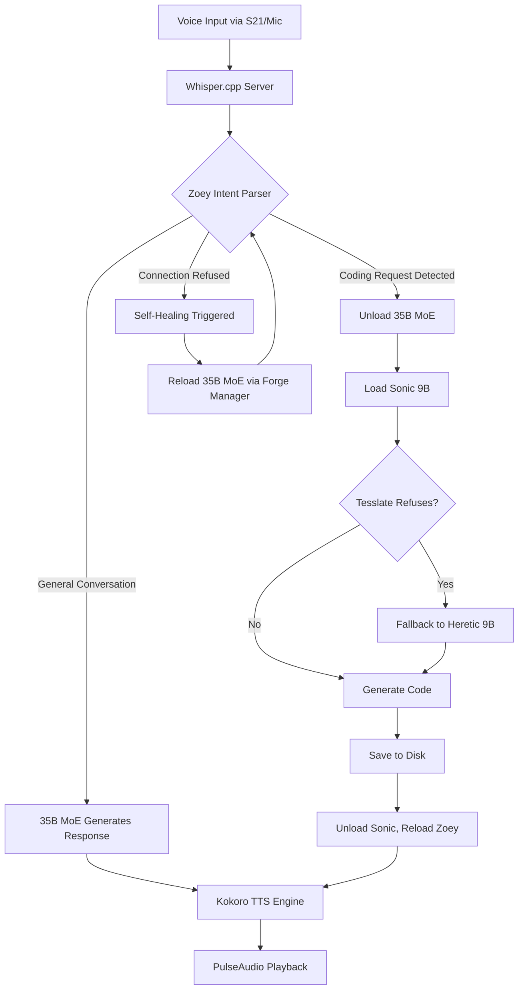

# The Sovereign Engine: A Local-First Autonomous AI Operating System

## Abstract
The Sovereign Engine is a highly optimized, distributed local AI architecture designed to operate autonomously without reliance on cloud-based APIs. Built to maximize the constraints of a 16GB VRAM GPU (RX 9070 XT) and a low-power single-board computer (Raspberry Pi 5), the system achieves near-zero latency, robust persona retention, and infinite-scaling memory. It utilizes a "Swarm Architecture" of specialized Local Language Models (LLMs), hierarchical memory tiers, and voice-driven tool orchestration.

---

## 1. System Architecture & Model Routing

The core philosophy of the Sovereign Engine is **Hardware Tetris**. Rather than relying on a single monolithic model that exceeds VRAM limits and causes severe CPU spillover (destroying Time-To-First-Token), the system dynamically loads and unloads specialized models based on the intent of the user.

### 1.1 The Sovereign Quartet
The system is composed of four specialized agent personas, distributed across the hardware:

1. **Zoey (The Engineer/Router):** 
   - **Model:** `Apollo-35B-Sovereign-Architect.iq2_xxs` (Qwen 3.5 35B MoE)
   - **Hardware:** Workstation GPU (Resident)
   - **Role:** The voice interface and primary orchestrator. She handles conversational logic, OS tool execution, and intent routing. Because she is a Mixture of Experts (MoE) model, she punches far above her weight class while only activating ~3B parameters during inference, keeping VRAM usage low and generation speed high.

2. **Sonic (The Fast Coder):**
   - **Model:** `Tesslate_OmniCoder-9B` (with fallback to `Qwen3.5-9B-Heretic`)
   - **Hardware:** Workstation GPU (Ephemeral / On-Demand)
   - **Role:** High-speed code generation. When coding is required, Zoey unloads herself, Sonic loads into VRAM, writes the script at 50+ TPS, saves it to the local disk, and unloads so Zoey can return.

3. **The Architect (The Heavy Coder):**
   - **Model:** `Qwen3.5-35B-A3B-heretic.i1-Q5_K_M`
   - **Hardware:** Workstation GPU + CPU RAM Spillover (Asynchronous)
   - **Role:** For massive, 1,000+ line architectural rewrites where speed is irrelevant but IQ is paramount. 

4. **Liara (The Librarian/Archivist):**
   - **Model:** `DeepScaleR-1.5B`
   - **Hardware:** Raspberry Pi 5 (`10.0.0.118`)
   - **Role:** The background janitor. She constantly reads the raw conversation logs, extracts JSON facts, and performs micro-summarization to keep Zoey's context window lean.

### 1.2 Model Routing Flowchart



---

## 2. Memory & Context Management

The most significant bottleneck for any local LLM is the Context Window. As the conversation history grows, the GPU must compute an increasingly large Key-Value (KV) Cache, which consumes VRAM and drastically slows down response times.

The Sovereign Engine solves this through a **Three-Tiered OpenClaw Memory Architecture** that provides infinite chronological awareness with O(1) constant-time KV-Cache scaling.

### Tier 1: The Ephemeral Rolling Buffer (O(1) Scaling)
Zoey's active context window *never* grows beyond the last 10 conversational turns. 

**Hypothetical Scenario:**
You have been talking to Zoey for 4 hours about a new robotics project. 
1. You say, *"So the final motor choice is the NEMA 17."*
2. This is the 11th turn in the active buffer.
3. The script intercepts Turn #1 (from 4 hours ago: *"Let's design a robot arm today."*) and sends it over the local network to **Liara** on the Pi 5.
4. Liara condenses the 200-word exchange into a single sentence: *"Mark initiated a robot arm design session."*
5. This single sentence is appended to a running `[Previous context summary]` block at the very top of Zoey's prompt, and the raw Turn #1 is deleted from her active memory.

**Result:** Zoey remembers the entire 4-hour conversation perfectly, but her KV-Cache is exactly as small (and her generation speed exactly as fast) as it was in minute one.

### Tier 2: The Librarian's Ledger (Fact Extraction)
Simultaneously, everything Zoey and the user say is logged to a raw daily markdown file (`memory_YYYY-MM-DD.md`). 

**Hypothetical Scenario:**
You say, *"I hate Python virtual environments, always use Docker from now on."*

1. This is logged to the daily file.
2. Liara (the 1.5B model on the Pi 5) reads the file in the background. 
3. She detects a user preference. She extracts a structured JSON object:
   ```json
   {
     "timestamp": "2026-03-18 18:05:22",
     "category": "user_trait",
     "fact": "Mark prefers using Docker over Python virtual environments.",
     "confidence_score_1_to_10": 10
   }
   ```
4. This fact is appended to the permanent `apollo_facts.jsonl` database.

### Tier 3: The Dream Cycle & Progressive Disclosure
During system downtime (e.g., 3:00 AM), the **Dream Cycle** executes. The Architect model spins up, reads the thousands of JSON facts Liara extracted that day, resolves any chronological contradictions using the timestamps, and writes them into permanent, categorized Markdown files (`Dossier.md`, `omni_shaper.md`).

**Progressive Disclosure:** 
Zoey does not load these massive files into her VRAM by default. Instead, her voice pipeline actively listens for keywords. 
If you say, *"Zoey, what sensor are we using for the Omni-Shaper?"*
The script intercepts the word "Omni-Shaper," rapidly fetches `omni_shaper.md` via SSH from the Pi 5, and injects it into her prompt just in time for her to read it and reply: *"We're using the BNO085 IMU."*

---

## 3. Self-Healing & Redundancy

A Sovereign AI must be resilient to hardware faults. The system includes autonomous self-correction hooks.
- **VRAM Spillage/OOM:** If the primary 35B model crashes due to VRAM overallocation, the python daemon detects the `ConnectionRefusedError`. 
- **Audible Alert:** Zoey's TTS engine fires a pre-cached warning: *"Someone tell Mark there is a problem with my AI. Attempting a hot restart."*
- **Hot Reload:** The system forcefully restarts the `llama-server` process and restores the active context state without losing the user's prompt. 

## Conclusion
By treating local AI not as a single model, but as an orchestrated network of specialized engines (Routers, Coders, Archivists) communicating over local silicon, the Sovereign Engine circumvents the traditional hardware limits of consumer GPUs. It operates as a true, locally sovereign Operating System.